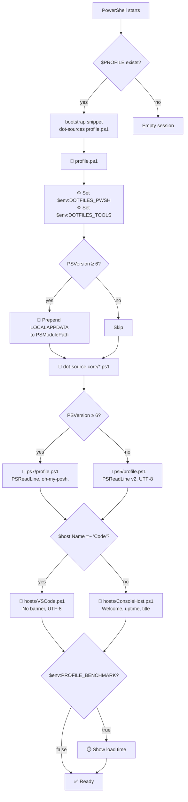

# dotfiles-powershell

> **Modular, version-controlled PowerShell profile** — bypasses OneDrive, auto-detects PS version & host, portable across machines.

[](#)
[](#)
[](https://github.com/PowerShell/PowerShell)
[](#)

---

## 🔗 Repo Boundary

| This repo (`dotfiles-powershell`) | Companion repo (`dotfiles-tools`) |
|------------------------------------|-------------------------------------|
| `~/.config/powershell/` | `~/Projects/tools/` |
| Profile orchestration | Menu & diagnostics |
| Bootstrap & install | Toolkit PowerShell module |
| Version/host profiles | Windows Terminal integration |
| Secret management helpers | Pester tests |
| 👉 **[github.com/martinpaprcka77/dotfiles-powershell](https://github.com/martinpaprcka77/dotfiles-powershell)** | 👉 **[github.com/martinpaprcka77/dotfiles-tools](https://github.com/martinpaprcka77/dotfiles-tools)** |
| **🌐 Portal: [martinpaprcka77.github.io](https://martinpaprcka77.github.io)** | |

---

## 📊 Summary

| What | Details |
|------|---------|
| **Location** | `~/.config/powershell/` (XDG convention, outside OneDrive) |
| **19 scripts** | `profile.ps1`, `install.ps1`, `remote-install.ps1`, `update.ps1`, `bootstrap.ps1`, `lib/output.ps1`, `lib/paths.ps1`, `core/aliases.ps1`, `core/functions.ps1`, `core/env.ps1`, `core/diag.ps1`, `core/perf.ps1`, `core/status.ps1`, `ps5/profile.ps1`, `ps7/profile.ps1`, `hosts/ConsoleHost.ps1`, `hosts/VSCode.ps1`, `hosts/wtprofile.ps1`, `hosts/shell-integration.ps1` |
| **3 docs** | ARCHITECTURE, PURPOSE, PROMPT |
| **Key features** | PS5/7 auto-detection, ConsoleHost/VSCode detection, PSModulePath fix (both PS5.1 and PS7), Known-Folder-correct paths (OneDrive-safe), profile benchmark, secret management |
| **Install** | One command: `irm <raw-url>/remote-install.ps1 \| iex` — or `git clone` → `install.ps1` → restart |

---

## 🧩 Architecture (UML)



---

## 🚀 Quick Install

**One command** — works from any PowerShell session, auto-detects everything:

```powershell
irm https://raw.githubusercontent.com/martinpaprcka77/dotfiles-powershell/main/remote-install.ps1 | iex
```

From cmd.exe, bash, or any shell with a PowerShell host on PATH:
```
powershell -c "irm https://raw.githubusercontent.com/martinpaprcka77/dotfiles-powershell/main/remote-install.ps1 | iex"
```

`-WhatIf`/`-Force`/`-NoUpdates`/`-NoTerminal` aren't reachable through `iex` — use
`$env:DOTFILES_FORCE=1` (etc.) before the command, or clone manually for full parameter parity:

```powershell
git clone https://github.com/martinpaprcka77/dotfiles-powershell.git ~/.config/powershell
~/.config/powershell/install.ps1
# Restart PowerShell → done
```

**What `install.ps1` does (either path ends up here):**
1. Inject bootstrap into all 4 `$PROFILE` paths — at the real, Known-Folder-correct Documents
   location, safe even when OneDrive redirects Documents elsewhere
2. Add `~/Projects/tools/bin` to permanent `PATH`
3. Offer Windows Terminal profile setup (via companion repo)

**Idempotent** — safe to run multiple times. `-WhatIf` supported (direct invocation only).

---

## 📦 Files

```
~/.config/powershell/
├── profile.ps1              ← main orchestrator
├── install.ps1              ← idempotent installer (-WhatIf, -Force, -NoUpdates)
├── remote-install.ps1       ← one-command bootstrapper, safe via `irm | iex`
├── update.ps1               ← git pull + rebootstrap
├── bootstrap.ps1            ← snippet injected into $PROFILE
├── .gitignore
├── lib/
│   ├── output.ps1           ← Write-Step/Ok/Skip/Fail/Warn, shared by install.ps1/update.ps1
│   └── paths.ps1            ← Resolve-DocumentsPath/Get-NativeProfilePaths (Known-Folder-correct)
├── core/
│   ├── aliases.ps1          ← git, docker, kubectl shortcuts
│   ├── functions.ps1        ← Edit-Profile, Reload-Profile, Get-SecretKey, mkcd
│   ├── env.ps1              ← $env:EDITOR, PATH, DOTFILES_TOOLS
│   ├── diag.ps1             ← ETW/PSDiagnostics tracing (Windows-only)
│   ├── perf.ps1             ← Measure-Profile, Clear-PSCache, Optimize-ModuleLoading
│   ├── status.ps1           ← Show-Status — global health dashboard
│   └── extra.ps1.example    ← template for user overrides (copy to extra.ps1)
├── starship.toml             ← Starship prompt config (30+ modules)
├── ps5/profile.ps1          ← Windows PowerShell 5.1
├── ps7/profile.ps1          ← Starship, PSReadLine, Terminal-Icons, PSFzf
├── hosts/
│   ├── ConsoleHost.ps1      ← welcome banner, wtprofile sourcing
│   ├── VSCode.ps1           ← UTF-8 encoding, TERM=vscode
│   ├── shell-integration.ps1← WT OSC 133 markers (command marks, scrollbar)
│   └── wtprofile.ps1        ← WT enhanced profile (zoxide, CTT utils, Show-Help)
└── docs/
    ├── ARCHITECTURE.md       ← Mermaid diagrams (loading flow, components)
    ├── PURPOSE.md            ← design rationale & decisions
    └── PROMPT.md             ← original AI prompt
```

---

## 📖 Docs

| Document | Description |
|----------|-------------|
| [ARCHITECTURE.md](docs/ARCHITECTURE.md) | Mermaid diagrams — loading sequence, component map, install flow |
| [PURPOSE.md](docs/PURPOSE.md) | Why this exists, 5 design decisions (XDG path, two repos, PSModulePath fix, etc.) |
| [PROMPT.md](docs/PROMPT.md) | Original AI prompt that generated this project |

---

## 🔑 Key Functions

| Function | Purpose | Alias |
|----------|---------|-------|
| `Edit-Profile` | Open profile in `$env:EDITOR` (code/nvim/notepad) | `ep` |
| `Reload-Profile` | Reload profile without restart | `rp` |
| `Get-SecretKey` | Get API key from SecretManagement vault (or `$env:VAR` fallback) | — |
| `Test-Admin` | Check if running as Administrator | — |
| `mkcd` | Create directory and `cd` into it | — |

---

## 🏷️ Companion Repo

The **dotfiles-tools** repo provides the Toolkit module, interactive menus, and system diagnostics:  
👉 **[github.com/martinpaprcka77/dotfiles-tools](https://github.com/martinpaprcka77/dotfiles-tools)**
