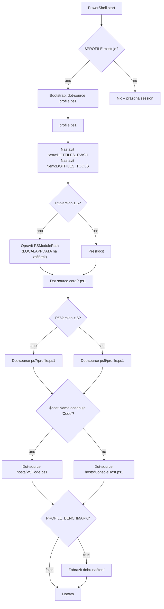
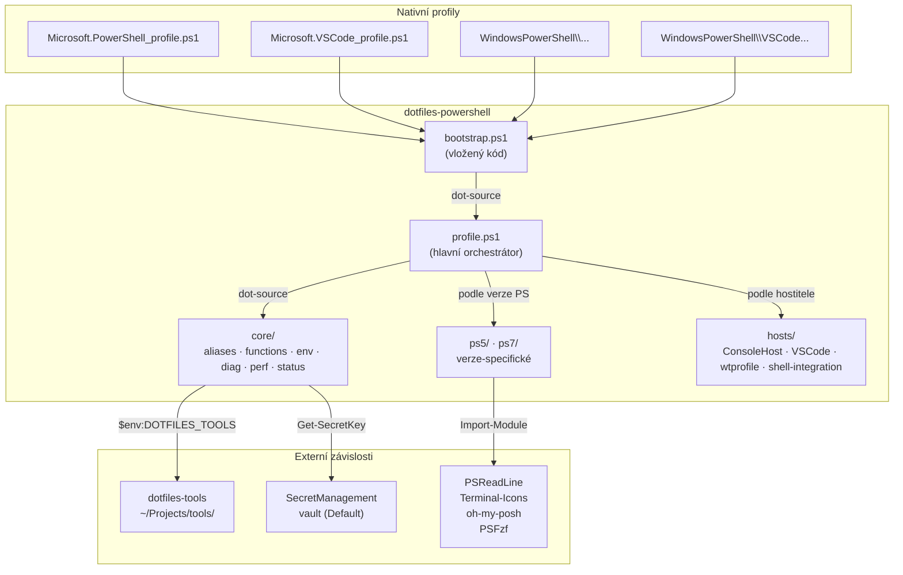
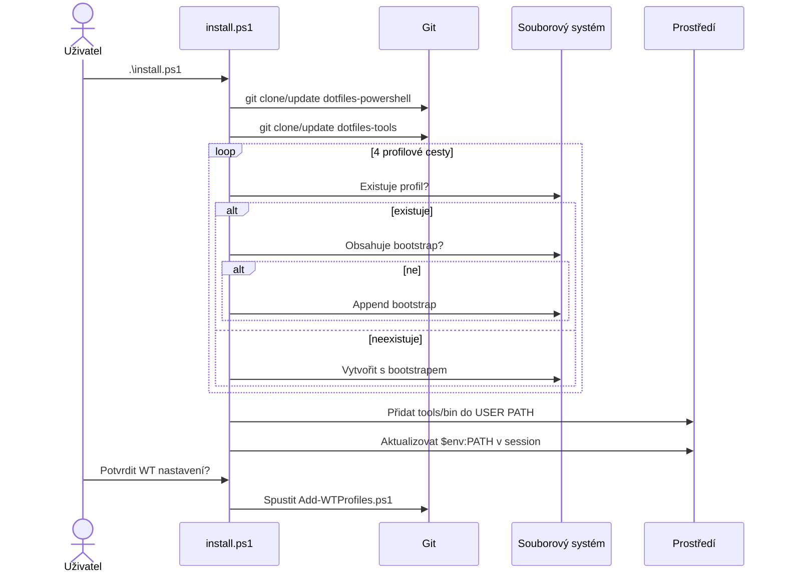

# Architektura dotfiles-powershell

## Diagram načítání profilu



## Komponentová mapa



## Mapa proměnných prostředí

| Proměnná | Nastavuje | Hodnota | Použití |
|----------|-----------|---------|---------|
| `$env:DOTFILES_PWSH` | `profile.ps1` | `~/.config/powershell` | Cesta k profilovému repu |
| `$env:DOTFILES_TOOLS` | `profile.ps1` / `core/env.ps1` | `~/Projects/tools` | Cesta k tools repu |
| `$env:EDITOR` | `core/env.ps1` | `code` / `nvim` / `vim` / `notepad` | Výchozí editor |
| `$env:PROFILE_BENCHMARK` | Uživatel | `true` / (prázdné) | Měření doby načtení |
| `$env:TERM` | `hosts/VSCode.ps1` | `vscode` | Indikátor VS Code terminálu |
| `$env:PSModulePath` | `profile.ps1` (PS7) | + `%LOCALAPPDATA%\PowerShell\Modules` | Oprava OneDrive |

## Flow instalace (install.ps1)



## Detekce verze a hostitele

```powershell
# Verze PowerShellu
if ($PSVersionTable.PSVersion.Major -ge 6) { "ps7" } else { "ps5" }

# Hostitel
if ($host.Name -match 'Code') { 'VSCode' } else { 'ConsoleHost' }
```
