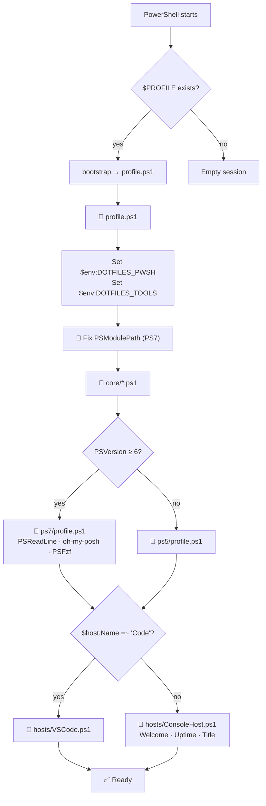
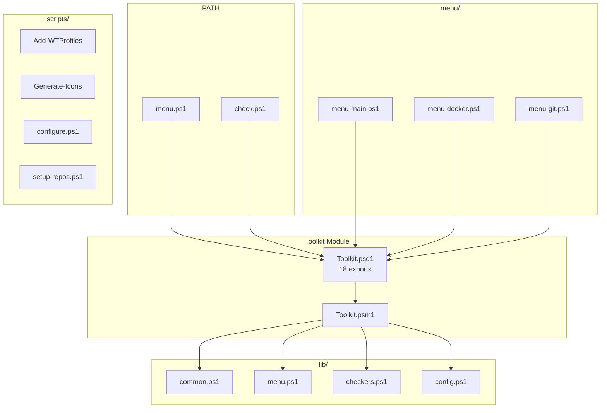
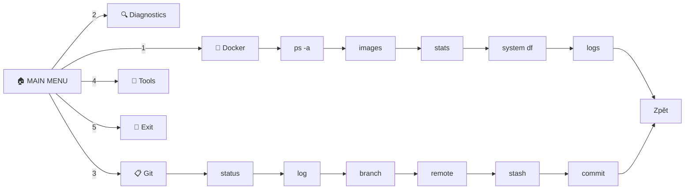

# ⚡ PowerShell Dotfiles Ecosystem

**Modulární, verzovaný, přenositelný** — profil, nástroje a automatické nastavení Windows Terminálu, které obchází OneDrive.

[](https://github.com/martinpaprcka77/dotfiles-powershell)
[](https://github.com/martinpaprcka77/dotfiles-tools)
[](https://martinpaprcka77.github.io/dotfiles-powershell/)
[](https://martinpaprcka77.github.io/dotfiles-tools/)
[](https://gist.github.com/martinpaprcka77/bafc2457fd9d93daf1b1b69c348e0cfd)
[](https://gist.github.com/martinpaprcka77/b30ae161dfb693431a438e309f236467)

---

## 🚀 One-Liner Install

```powershell
git clone https://github.com/martinpaprcka77/dotfiles-powershell.git $HOME/.config/powershell
git clone https://github.com/martinpaprcka77/dotfiles-tools.git $HOME/Projects/tools
& $HOME/.config/powershell/install.ps1
```

**Restart PowerShell** → `menu` + `check` ready.

---

## 🗺️ Repo Boundary

| | [dotfiles-powershell](https://github.com/martinpaprcka77/dotfiles-powershell) | [dotfiles-tools](https://github.com/martinpaprcka77/dotfiles-tools) |
|---|---|---|
| **Location** | `~/.config/powershell/` | `~/Projects/tools/` |
| **Purpose** | Profile orchestration | Menu & diagnostics |
| **Module** | — | `Toolkit` (18 functions) |
| **Key files** | `profile.ps1`, `install.ps1`, `update.ps1` | `menu.ps1`, `check.ps1`, `configure.ps1` |
| **Tests** | — | 25+ Pester cases |
| **Pages** | [🔗 martinpaprcka77.github.io/dotfiles-powershell](https://martinpaprcka77.github.io/dotfiles-powershell/) | [🔗 martinpaprcka77.github.io/dotfiles-tools](https://martinpaprcka77.github.io/dotfiles-tools/) |
| **Gists** | [🚀 Install](https://gist.github.com/martinpaprcka77/bafc2457fd9d93daf1b1b69c348e0cfd) · [📋 Cheatsheet](https://gist.github.com/martinpaprcka77/b30ae161dfb693431a438e309f236467) | — |

---

## 🧩 UML: Profile Loading Flow



---

## 🧩 UML: Tools Component Diagram



---

## 🧩 UML: Menu Hierarchy



---

## 📋 Command Reference

| Command | What it does |
|---------|-------------|
| `menu` | Interactive main menu |
| `check` | Full system diagnostics |
| `update` | Git pull + reload profile |
| `configure` | Interactive setup wizard |
| `ep` | Edit profile |
| `rp` | Reload profile |
| `ll` | `Get-ChildItem` with force |

### Git Shortcuts

`g` `gst` `gco` `gbr` `gcm` `gpl` `gps` `gdf` `glo`

### Docker Shortcuts

`dps` `dpsa` `dcu` `dcd`

---

## 📚 Documentation Index

### dotfiles-powershell

| Doc | Description |
|-----|-------------|
| [README](https://github.com/martinpaprcka77/dotfiles-powershell#readme) | Overview, install, function reference |
| [ARCHITECTURE.md](https://github.com/martinpaprcka77/dotfiles-powershell/blob/main/docs/ARCHITECTURE.md) | 4 Mermaid diagrams — loading flow, components, install sequence |
| [PURPOSE.md](https://github.com/martinpaprcka77/dotfiles-powershell/blob/main/docs/PURPOSE.md) | Design rationale — 4 problems solved, 5 design decisions |
| [PROMPT.md](https://github.com/martinpaprcka77/dotfiles-powershell/blob/main/docs/PROMPT.md) | Original 107-line AI prompt |

### dotfiles-tools

| Doc | Description |
|-----|-------------|
| [README](https://github.com/martinpaprcka77/dotfiles-tools#readme) | All 18 functions, UML, menu hierarchy |
| [ARCHITECTURE.md](https://github.com/martinpaprcka77/dotfiles-tools/blob/main/docs/ARCHITECTURE.md) | 6 Mermaid diagrams — components, WT sequence, menu engine |
| [MANUAL.md](https://github.com/martinpaprcka77/dotfiles-tools/blob/main/docs/MANUAL.md) | 11-section user guide with every command |
| [ROADMAP.md](https://github.com/martinpaprcka77/dotfiles-tools/blob/main/docs/ROADMAP.md) | 5 phases — completed, planned, known issues |
| [PROMPT.md](https://github.com/martinpaprcka77/dotfiles-tools/blob/main/docs/PROMPT.md) | Original AI prompt |

---

## 🗺️ Roadmap

| Phase | Status | Items |
|-------|--------|-------|
| **1. Foundation** | ✅ Done | Modular profile, install, Toolkit module (18 funcs), menus, diagnostics, WT profiles, Pester tests |
| **2. Tools** | 🟡 Planned | Custom user tools, menu extensions |
| **3. Extensions** | 🟡 Planned | Linux/macOS support, config wizard, health check, live dashboard |
| **4. Integration** | 🟢 Future | VS Code extension, WSL profiles, oh-my-posh theme, git hooks |
| **5. Ecosystem** | 🟢 Future | Windows installer, CI/CD, PowerShell Gallery, docs site |

[Full roadmap →](https://github.com/martinpaprcka77/dotfiles-tools/blob/main/docs/ROADMAP.md)

---

## ⚡ Quick Links

| Resource | URL |
|----------|-----|
| **dotfiles-powershell** | [github.com/martinpaprcka77/dotfiles-powershell](https://github.com/martinpaprcka77/dotfiles-powershell) |
| **dotfiles-tools** | [github.com/martinpaprcka77/dotfiles-tools](https://github.com/martinpaprcka77/dotfiles-tools) |
| **Pages — powershell** | [martinpaprcka77.github.io/dotfiles-powershell](https://martinpaprcka77.github.io/dotfiles-powershell/) |
| **Pages — tools** | [martinpaprcka77.github.io/dotfiles-tools](https://martinpaprcka77.github.io/dotfiles-tools/) |
| **Gist — Install** | [gist.github.com/.../bafc2457](https://gist.github.com/martinpaprcka77/bafc2457fd9d93daf1b1b69c348e0cfd) |
| **Gist — Cheatsheet** | [gist.github.com/.../b30ae16](https://gist.github.com/martinpaprcka77/b30ae161dfb693431a438e309f236467) |

---

*Built with PowerShell · Git · GitHub Pages · Mermaid*
